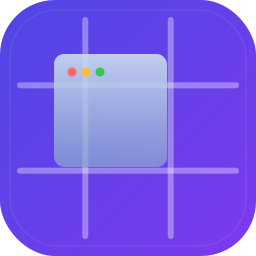

# Sniq

<p align="center"><strong>Snap your windows into place</strong> · 창을 딱 맞게 배치</p>

<p align="center">
  
</p>

> Shift + 드래그(또는 키보드 단축키)로 윈도우를 두 개의 커스텀 레이아웃에 스냅하는 macOS 유틸리티

macOS에 내장된 윈도우 스냅은 화면 절반 정도만 지원합니다. Sniq은 **두 개의 레이아웃을 미리 지정해두고 Shift / Shift+Ctrl 로 즉시 전환**하며 창을 자유롭게 배치합니다. 드래그와 키보드 단축키 두 경로를 모두 지원합니다.

## 특징

- **두 레이아웃 즉시 전환** — Primary (Shift) · Secondary (Shift+Ctrl), 각각 독립 행·열 (1–10)
- **Shift + 제목줄 드래그** — Primary 레이아웃 그리드 오버레이 표시, 놓으면 셀에 스냅
- **Shift + Ctrl + 드래그** — Secondary 레이아웃으로 전환
- **드래그 중 Ctrl 토글** — 레이아웃을 실시간으로 바꿔가며 비교 가능
- **Opt 추가** — 여러 셀에 걸친 직사각형 영역으로 스냅 (두 레이아웃 모두 동일 동작)
- **키보드 단축키 (opt-in)** — `Shift+Opt+화살표` 로 Primary, `Shift+Ctrl+Opt+화살표` 로 Secondary 레이아웃 인접 셀로 즉시 이동. 텍스트 편집 중에는 자동 우회
- **다중 모니터 지원** — 각 화면에 독립 그리드 표시
- **메뉴바 앱** — Dock 아이콘 없이 메뉴바에서만 동작
- **다크/라이트 모드** 자동 대응
- **로그인 시 자동 실행** 지원
- 외부 의존성 없음 (순수 Swift + AppKit + SwiftUI)

## 설치

### Homebrew (추천)

```bash
brew tap oh-research/tap
brew install --cask sniq
```

### 수동 설치

1. [Releases](https://github.com/oh-research/Sniq/releases)에서 `.dmg` 다운로드
2. `Sniq.app`을 `/Applications`로 드래그
3. 최초 실행 전 Gatekeeper 우회:
   ```bash
   xattr -cr /Applications/Sniq.app
   ```
4. 앱을 실행하면 **How to Use...** 창이 나타나 사용법과 권한 설정을 안내합니다

## 사용법

### Primary 레이아웃 (Shift)

1. 창 제목줄을 드래그하면서 **Shift**를 누르세요
2. Primary 레이아웃의 그리드 오버레이가 나타나고 커서 위치의 셀이 하이라이트됩니다
3. 마우스를 놓으면 창이 해당 셀 크기/위치로 스냅됩니다

### Secondary 레이아웃 (Shift + Ctrl)

1. **Shift + Ctrl** 를 함께 누른 채 제목줄을 드래그하세요
2. Secondary 레이아웃의 그리드 오버레이가 나타납니다
3. 마우스를 놓으면 창이 Secondary 레이아웃의 셀로 스냅됩니다

> 드래그 중에 **Ctrl** 만 눌렀다 뗐다 하면 Primary ↔ Secondary 가 실시간으로 전환됩니다.
> (단, Opt 로 다중 셀 선택 중에는 무시됩니다)

### 다중 셀 스냅

1. Shift + 드래그 중 **Opt**를 추가로 누르세요
2. Opt를 누른 시점의 셀이 앵커가 되고, 커서 이동에 따라 직사각형 영역이 하이라이트됩니다
3. 마우스를 놓으면 직사각형 영역 전체 크기로 스냅됩니다

### 키보드 단축키 (opt-in)

**Settings...** → **Keyboard shortcuts** 토글을 켜면 활성화됩니다 (기본 OFF).

- `Shift + Opt + ←/→/↑/↓` — 포커스 창을 **Primary** 레이아웃의 인접 셀로 즉시 이동
- `Shift + Ctrl + Opt + ←/→/↑/↓` — 포커스 창을 **Secondary** 레이아웃의 인접 셀로 즉시 이동

텍스트 편집 중(TextEdit, Notes, Xcode 등)에는 Sniq 이 이벤트를 가로채지 않고 macOS 기본 단어 선택이 동작합니다. 터미널 에뮬레이터(iTerm2, Terminal 등)는 창 조작이 우선이 되도록 예외 처리됩니다.

## 권한

Sniq은 두 가지 macOS 권한이 필요합니다:

- **손쉬운 사용(Accessibility)** — 창 이동/크기 조절에 필요
- **입력 모니터링(Input Monitoring)** — Shift + 드래그 제스처 감지에 필요

첫 실행 시 **How to Use...** 창에서 권한 설정을 안내합니다. 메뉴바에서 언제든 다시 열어 권한 상태를 확인할 수 있습니다.

## 메뉴

메뉴바 아이콘을 클릭하면 다음 항목이 표시됩니다:

- **Enabled** — Shift+드래그 감지 토글 (잠시 멈추고 싶을 때 해제)
- **Settings...** — 행/열 수, 프리셋, 자동 실행 등 설정 창
- **How to Use...** — 사용법과 권한 안내 창
- **About Sniq** — 버전·빌드 번호·개발자·GitHub 저장소 링크
- **Quit Sniq** — 종료 (⌘Q)

## 설정

메뉴바 아이콘 > **Settings...**에서 변경할 수 있습니다:

- **Primary layout (Shift)** — 행·열 수 (1–10)
- **Secondary layout (Shift + Ctrl)** — 행·열 수 (1–10)
- **Keyboard shortcuts (Shift + Opt + Arrow)** — 기본 OFF
- **로그인 시 자동 실행**

### 설정 예시

| 사용 환경 | Primary | Secondary |
|---|---|---|
| 일반 노트북 | 2×1 (좌우 반반) | 2×2 (사분할) |
| 울트라와이드 | 3×1 | 3×2 |
| 세로 모니터 | 1×2 | 1×3 |
| 개발 | 3×1 (코드·브라우저·터미널) | 2×2 |

## 소스에서 빌드

macOS 15+ 및 Swift 6이 필요합니다.

빠른 개발 실행 (SPM):

```bash
git clone https://github.com/oh-research/Sniq.git
cd Sniq/Sniq
swift run
```

릴리스 빌드 + DMG (xcodegen + xcodebuild, `brew install xcodegen` 필요):

```bash
./scripts/local-build.sh       # build/Sniq.app + build/sniq-X.Y.Z.dmg
./scripts/local-install.sh     # /Applications 설치 + 실행
./scripts/local-uninstall.sh   # 제거 (사용자 설정은 보존)
```

버전은 `Sniq/project.yml` 의 `MARKETING_VERSION` 한 곳에서 관리됩니다.

## 요구 사항

- macOS 15.0 (Sequoia) 이상

## 삭제

### Homebrew

```bash
brew uninstall --cask sniq
```

### 수동 삭제

```bash
rm -rf /Applications/Sniq.app
```

## 기술 스택

- **Swift 6 + AppKit** — 이벤트 감지, 오버레이, 창 조작
- **SwiftUI** — Settings, How to Use, About 창
- **CGEventTap** (passive) — 마우스/modifier 이벤트 수신
- **AXUIElement** — 커서 아래 창 획득 및 크기/위치 변경
- **SPM** — 패키지 관리

## 라이선스

MIT License
